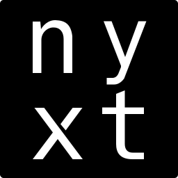

# `:nxconfig` - Nyxt Browser Configuration 

Personal configuration for the highly extensible Nyxt Browser with batteries
included.  This configuration scaffold is set up as its own modern CL system
so as to keep things modular.

A cool feature is the system is loaded in such a way to fail *quietly* and
and generate `*.log` files: `error.log` lists any issues encounted upon
loading and `startup.log` lists successfull startup and details of startup 
(WIP).


PS: Only tested and used on Fedora 42 Workstation...

<p align="center">
  
</p>


## Dependencies
  - [nyxt](https://github.com/atlas-engineer/nyxt)
  - [ocicl](https://github.com/ocicl/ocicl)
  - `nx-nord-themes` (Included - A dark Nord theme based on Nyxt's Invader theme)
  - `nxcode` (Included - *WIP* A Editor/IDE extension for Nyxt)
     - tbd
  - TCP Servers configuration
  - slynk
  - swank
  - micros     

## Project Scaffold
```lisp
  ~/.config/nyxt/
    config.lisp
    nyxt-config.asd
    setup.lisp
    |- assets/
    |- extensions/
       |- nx-nord-themes/
       |- nxcode/
    |- source/
       |- all.lisp
       |- browser.lisp
       |- keepassxc-pwi.lisp
       |- tcp-servers.lisp
       |- extensions.lisp
       |- hacks.lisp
```

## Installation/Setup
Download this repo from `https://github.com/logoraz/nyxt-config`:

```bash
   $ cd ~/.config
   $ git clone https://github.com/logoraz/nyxt-config.git nyxt
```

Next, setup extensions directory to utilize the "batteries" included with this
configuration:

```bash
   $ cd nyxt
   $ sbcl --load setup.lisp
```

This script ensures `~/.local/share/nyxt/` directory exists, then creates a
symlink from `~/.config/nyxt/extensions` to `~/.local/share/nyxt/extensions/`


### Loading Common Lisp dependencies required for extensions
I use [ocicl](https://github.com/ocicl/ocicl) for my external Common Lisp systems
management because it provides a lot of conveniency and is far more superior and 
more secure than the other distribution tools out there that depend on quicklisp 
(namely qlot, roswell, ultralisp, etc.). It's time to move away from quicklisp
folks!

First, install `ocicl` following the install instructions on their readme.

Next, let's install the external dependencies for the TCP servers configuration

```bash
   $ cd ~/.config/nyxt/source/
   # Dependencies are specified in 'ocicl.csv'
   $ ocicl install
```

A neat feature of the `ocicl` command line tool that I suggested (see 
[Issue 122](https://github.com/ocicl/ocicl/issues/122)) and the folks at `ocicl`
quickly implemented in part - is `tree`, which lists out installed dependencies, 
you can trial it out as follows to see what dependencies were installed above:

```bash
   $ ocicl tree --depth=4
   #/home/<username>/.config/nyxt/source/ocicl.csv
   #├─ micros
   #├─ slynk
   #└─ swank
```

If you are feeling daring, you can hack my current experimental extension
`nxcode`, a modern emacs-like Editor/IDE I am developing for nyxt. 

Considering of incorporating `cl-treesitter`, below is the build recipe for
doing so...Currently not needed as a dependency as there is only treesitter
bindings available for java in Fedora...

Fedora dependencies:
```bash
   $ sudo dnf install make gcc libtree-sitter-devel
```

Now lets get the `cl-treesitter` source and compile:
```bash
   # First retrieve the source of `cl-treesitter'
   $ cd ~/.config/nyxt/extensions/nx-code/
   $ mkdir ocicl && cd ocicl
   $ git clone https://github.com/garlic0x1/cl-treesitter.git
   $ cd cl-treesitter
   # Installs/Compiles shim.c required for cl-treesitter
   # ocicl will handle any of the external dependencies required therein...
   $ sbcl --eval "(asdf:load-system 'cl-treesitter) (sb-ext:quit)"
``

## TODOs (Wish List)
  - Establish custom keybindings...
  - Continue efforts on developing `nxcode` Editor/IDE for Nyxt.
  - tbd


## References:
  - https://github.com/atlas-engineer/nyxt
  - https://github.com/aartaka/nyxt-config
  - tbd
