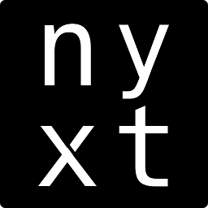

# nyxt-config - Nyxt Browswer Configuration 

Personal configuration for Nyxt Browser.

  

## TODOs (Wish List)

  - Get password-interface working for Flatpak release (KeePassXC)
  - Troubleshoot nx-micros extension to connect to Lem
  - Continue efforts on developing nx-code

   
## References:

  - TBD
  - TBD
