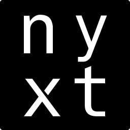

# `:nxconfig` - Nyxt Browser Configuration 

Personal configuration for the highly extensible Nyxt Browser with batteries
included.  This configuration scaffold is set up as its own modern CL system
so as to keep things modular.

A cool feature is the system is loaded in such a way to fail *quietly* and
and generate `*.log` files: `error.log` lists any issues encounted upon
loading and `startup.log` lists successfull startup and details of startup 
(WIP).


PS: Only tested and used on Fedora 42 Workstation...

<p align="center">
  
</p>


## Dependencies
  - [nyxt](https://github.com/atlas-engineer/nyxt)
  - [ocicl](https://github.com/ocicl/ocicl)
  - `nx-nord-themes` (Included - A dark Nord theme based on Nyxt's Invader theme)
  - `nxcode` (Included - *WIP* A Editor/IDE extension for Nyxt)
     - tbd
  - TCP Servers configuration
    - slynk
    - swank
    - micros     


## Installation/Setup
Download this repo from `https://github.com/logoraz/nyxt-config`:

```bash
   $ mkdir -p ~/Work/
   $ cd ~/Work/
   $ git clone https://github.com/logoraz/nyxt-config.git
```

Deploy this config to `~/.config/nyxt/`, note that `setup.lisp` assumes you
have built Nyxt from source (in `~/Work/builds/nyxt`):

```bash
   $ cd ~/Work/nyxt-config/
   $ sbcl --load setup.lisp
```

`setup.lisp` ensures the following config framework is mapped to `~/.config/nyxt`
and ensures your Nyxt build is "installed" locally:

**config scaffold** deployed
```lisp
  ~/.config/nyxt
   |s-> config.lisp  ; symlink
   |s-> nxconfig.asd ; symlink
   |s-> version.sexp ; symlink
   |s-> source/      ; symlink
   |s-> extensions/  ; symlink
   |+-> logs/        ; creates
   |+-> ocicl/       ; creates
```

**build scaffold** deployed
```lisp
  ~/Work/builds/nyxt/nyxt --> ~/.local/bin/nyxt
  ~/Work/nyxt-config/assets/nyxt.desktop --> ~/.local/share/applications/nyxt.desktop
  ~/.config/nyxt/ocicl
   |--> slynk  ; installs via ocicl
   |--> swank  ; installs via ocicl
   |--> micros ; installs via ocicl
```


## Build Nyxt 4 (Fedora)
Install system dependencies & build Nyxt from source:

```bash
  $ sudo dnf install nodejs enchant2-devel libfixposix-devel
  $ cd ~/Work/builds/
  $ git clone --recurse-submodules https://github.com/atlas-engineer/nyxt.git
  $ cd nyxt && make all
```

To get Nyxt build running, `_build/cl-electron/package.json` needs to be 
ammended as follows:

```json
 ...
 "scripts": {
   ...
   "start": "electron --gtk-version=3",
   ...
   },
 ...
```


## TODOs (Wish List)
  - Establish custom keybindings...
  - Continue efforts to update Nyxts build using `ocicl`
  - Start developing `nxcode` Editor/IDE for Nyxt.


## References:
  - https://github.com/atlas-engineer/nyxt
  - https://github.com/ocicl/ocicl
  - https://github.com/aartaka/nyxt-config
  